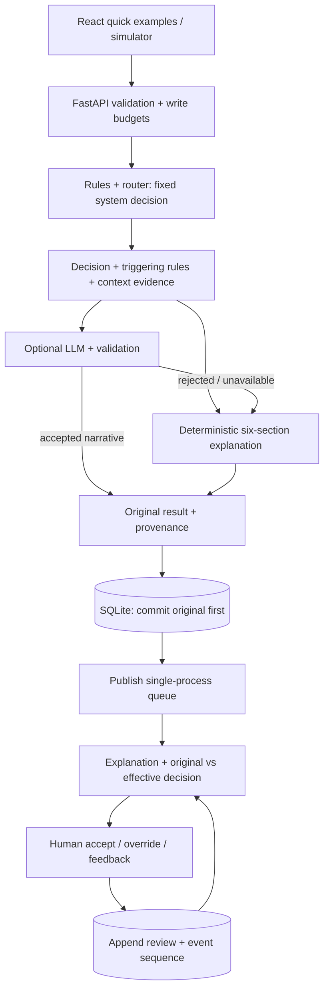

# Clinical Alert Triage Assistant

[Repository](https://github.com/hsivasambu/clinical-alert-triage) · [Demo](https://clinical-alert-triage-t7t1.vercel.app) · [Blog](https://blog.harry-sivasambu.com/blog/clinical-alert-triage)

**Simulated data / portfolio demo.** Rules assign priority and routing; optional AI explains; humans review. This is a software architecture demonstration, not a clinically validated service. The linked deployment may lag the tested source. This documentation update does not deploy it.

## Demo walkthrough

1. Open the demo or start it locally below. An available example is selected initially without replacing later user selections. Historical fixtures are labeled; alert time and processing time are distinct.
2. Choose **Deterministic threshold**, **Context-based routing**, or **Repeat escalation**, then **Run example**. Each submits a fresh simulated alert. **Advanced customization** opens the full six-type simulator.
3. Inspect the priority/destination/review header and six explanation sections: summary, factors, routing rationale, uncertainty, readable rule evidence, verification guidance. Expand source, full context or technical provenance as needed.
4. Accept the displayed version, or override with reviewer label and reason. Compare original and effective decisions; leave explanation feedback.
5. Read chronological audit history and refresh. Saved reviews return when backend storage persists. Selecting an alert displays its **recorded** explanation, without generating a new model answer.

Desktop shows queue/detail together; narrow screens show a full-width selection with **Back**. Search covers alert/patient ID and unit. Priority/status filters use effective values and clear a hidden selection. Severity-first sorts Critical, High, Medium, Low, then alert time descending and ID; newest-first sorts alert time descending and ID. Keyboard selection, visible focus, dialog Escape/focus restoration and status/error announcements have regression coverage.

## Authority and human review

`final_priority` equals `rule_output.baseline_priority`; `final_route` comes from the deterministic router. The LLM cannot raise/lower priority, reroute, diagnose, infer causes or recommend treatment. Its schema has no decision fields. Validation/fallback choose only explanation content and mode.

| Action | Effective decision/status |
| --- | --- |
| No review | Original priority/route, version 0, `unreviewed` |
| Override | Latest override priority; omitted/empty route retains preceding effective route; override ID becomes version; `overridden` |
| Accept | Snapshot of current version/priority/route; `accepted` for that version |
| Later override | New version, `overridden`, even if values equal an older accepted decision |
| Feedback / repeated acceptance | Append records; feedback does not change decisions/status |

Humans may raise **or lower any priority, including Critical**, and provide a route. The system rules floor does not constrain human overrides. There is no authenticated reviewer identity, role-based approval or clinically validated downgrade policy. Reviewer IDs are typed demo labels. The UI sends `decision_version`; stale acceptance returns 409. Old clients may omit it, causing the server to snapshot the current version. Legacy acceptances with unknown snapshots remain visible but do not imply current acceptance.

`review_state` separately exposes `effective_priority`, `effective_route`, `decision_version`, `review_status`. Original `final_priority`/`final_route` never change. History loads per selection and after refresh. Drafts/messages reset when switching alerts, including Critical to High during an override. Successful saves update queue/detail immediately; a failed audit refresh confirms the save and offers a **read-only** retry. Write timeouts have an unknown outcome: inspect history before resubmitting. Writes are never automatically retried.

## Architecture



[Architecture/API contract](docs/mvp-architecture.md) · [Project brief](docs/project-brief.md) · [Evaluation report](docs/evaluation-report.md)

## Explanation and confidence semantics

Rules-only mode fills all six sections from actual input, matched conditions and router branch. Missing measurements are unavailable, not normal. Guidance concerns identifiers, units, timestamps, evidence and human review, not treatment. Triggering rules and contextual observations are distinct; canonical evidence values are rendered deterministically.

Model output requires nonblank narrative/items, valid rule/observation IDs and recognized measurements consistent with evidence. Detected contradictions, unsupported numeric claims, refusals and configured prohibited phrases cause fallback. **Checks are heuristic, not semantic safety guarantees.** Unsupported nonnumeric claims/paraphrases can escape; citations do not prove every sentence grounded. Legacy records remain unchanged, not revalidated.

Structured reasons appear in API/audit/UI: `llm_disabled`, `provider_failure`, `provider_timeout`, `malformed_output`, `schema_invalid`, `low_confidence`, `content_rejected`, `evidence_mismatch`, `contradiction`, `not_supplied` (local caller). Legacy reasons may be unknown. Provider timeout is 15 seconds; SDK retries zero.

`llm_self_reported_confidence` is the model's explanation estimate. `llm_confidence_estimate` applies a deterministic completeness/noise cap (0.68–0.95); below 0.5 selects fallback. Neither is calibrated clinical reliability. Legacy `rule_confidence` contains manual demo weights, does not drive decisions, and is not measured reliability. Cap details are in the architecture document.

New provenance includes rules version, prompt version/template and rendered-message hashes, configured/returned model where available, validation version/outcome/issues, fallback reason, duration and correlation ID. Accepted narrative/evidence is stored; rejected raw provider text is not archived. SQLite feedback stores rating/category/comment/reviewer/time; it does **not** update rules, prompts, model or training. `not_helpful` requires a valid category; repeated feedback is allowed.

## Local setup

Use Python 3.11 and Node 20 (CI versions). From a fresh checkout:

```powershell
git clone https://github.com/hsivasambu/clinical-alert-triage.git
cd clinical-alert-triage
python -m venv backend/venv
./backend/venv/Scripts/pip.exe install -r backend/requirements.txt
$env:LLM_ENABLED = 'false'
cd backend
./venv/Scripts/uvicorn.exe main:app --reload
```

Another terminal, from the checkout:

```powershell
cd frontend
npm ci
npm run dev
```

On Unix use `backend/venv/bin/pip` and `backend/venv/bin/uvicorn`. App: [localhost:5173](http://localhost:5173); API schema: [localhost:8000/docs](http://localhost:8000/docs). Vite proxies `/alerts`, `/audit`, `/ready`, `/health`, `/meta` to port 8000. No key is required. Empty databases seed six offline fixtures; `SEED_SAMPLE_DATA=false` disables seeding.

For live narrative set `LLM_ENABLED=true`, `OPENAI_API_KEY` and optionally `LLM_MODEL` (default `gpt-4o-mini`) before backend startup. Keep credentials outside Git. Missing keys disable generation; failures preserve decisions and fall back. [demo.env.example](backend/demo.env.example) documents settings; it is not automatically loaded as `.env`.

## Verified engineering evidence

On **2026-10-05**, source [`2a1b169`](https://github.com/hsivasambu/clinical-alert-triage/commit/2a1b169893d0c5e65ff37584ad7fe34d5082ab20):

| Check | Actual result |
| --- | --- |
| Backend, isolated/mocked provider | 211 passed |
| Frontend component/UI | 43 passed |
| Mocked API browser/layout, local Edge | 16 passed; widths 320, 390, 768, 1024, 1440 |
| Real API + temporary SQLite integration | 2 passed locally in Edge and hosted Chromium CI |
| Frontend type check / build | Passed |
| Offline evaluation | 60 alerts × 17 provider fixtures = 1,020 runs, plus eight invalid inputs; no unexpected outcomes |

[Hosted CI](https://github.com/hsivasambu/clinical-alert-triage/actions/runs/37359198842) passed backend, frontend and integration for that revision. CI runs on push/PR/manual invocation. Mocked layout tests are a separate local suite.

For this documentation update, backend (211), UI (43), type check/build and offline evaluation were rerun successfully. The worked blog example also passed real isolated API submission, fallback, override, exact-version acceptance and restart reload. Browser/layout and integration counts above refer to the prior source verification, not new browser runs for documentation-only changes. Local pytest reported two cache-write permission warnings; test assertions passed.

Expected system priority **and route** were preserved in 1,020/1,020; final schemas passed 1,020/1,020; complete fallback passed 900/900. Intentionally malformed raw provider fixtures passed schema in 600/840. Adversarial rejection was **420/480 (87.5%)**: the same unsupported nonnumeric claim escaped in 60 reused runs. All 120 accepted hybrid records passed mechanical evidence checks, which do not prove complete grounding. Templates are reused and correlated. **Zero human-assessed narratives; no clinical/narrative-quality score.** See [definitions/hashes/limitations](docs/evaluation-report.md) and [JSON results](docs/evaluation-results.json).

Reproduce from the checkout on Windows:

```powershell
./backend/venv/Scripts/python.exe -m pytest -q --basetemp=.test-tmp-doc-check
./backend/venv/Scripts/python.exe backend/evaluate_demo.py --check
cd frontend
npm run typecheck
npm test
npm run build
npm run test:browser
$env:DEMO_TEST_PYTHON = (Resolve-Path ../backend/venv/Scripts/python.exe).Path
npm run test:integration
```

Backend tests block unmocked external calls; evaluation uses local fixtures without writing demo storage. Integration launches API/Vite on ports 8011/5175 with temporary SQLite and provider disabled. Local Playwright uses installed Edge; CI installs Chromium. Coverage includes scenario → explanation → accept/override → audit → refresh, duplicate IDs and switching override drafts. Backend tests separately cover restart reload/failed writes. Free test ports first.

## Persistence, startup and deployment

SQLite defaults to `backend/audit.db`. `DEMO_DB_PATH` can point to an absolute path on a writable **persistent mount** whose parent exists. Originals commit before entering memory. Transactions reserve unique IDs; duplicates return 409 across restarts. Failed writes return 503 without memory-only decisions. Reviews/event sequences commit together. Additive migrations preserve old JSON/unknown provenance.

`/health` (GET/HEAD) is liveness only. `/ready` distinguishes initializing 202, ready 200, unavailable 503, with alert/seed-failure counts. `/alerts` remains an array with `X-Demo-State`; unavailable storage returns 503. Initialization polls every two seconds, at most six reads then Retry; failed reads get three attempts. Read/write timeouts are 10/25 seconds. Ready empty differs from initializing/unavailable.

Public POST defaults: 16,384-byte bodies, ten-second total receive deadline, 20 writes/client/minute, 120/process/minute, concurrency two, 1,000 stored alert IDs, 10,000 combined reviews. Oversize/slow/busy requests return 413/408/429; capacity/storage failures 503. Counters track at most 1,024 client addresses. These are single-process budgets, not authentication, distributed protection or guaranteed cost control. Configure trusted proxies/provider billing limits separately.

No TTL/public reset exists. Refresh retains history; persistent restart reloads it. Ephemeral hosting can lose shared history and reseed. Run **one worker**: queue/rate state is in memory. Operator reset: stop the process, archive the configured DB and any WAL/SHM files, restart; running backups use SQLite backup APIs. Archives need their own retention policy. Submit synthetic data only; this public demo is unsuitable for sensitive patient/reviewer information.

Existing targets: Vercel (`frontend`, `npm run build`, output `dist`, build-time `VITE_API_URL`) and [Render API](https://clinical-alert-triage-api.onrender.com) (`backend`, install requirements, `uvicorn main:app --host 0.0.0.0 --port $PORT`, one worker). Set `ALLOWED_ORIGINS` to frontend origin, `LLM_ENABLED=false` for offline demo, persistent `DEMO_DB_PATH` for restart retention. Wait for `/ready` 200; `/health` is liveness. A push does not provision storage or prove the hosted revision.

Future work: authenticated reviewer policies, multi-instance shared state/limits, broader semantic checks, human narrative assessment, any clinical integration/validation. None is demonstrated here. [Local blog draft and publication/deployment checklist](docs/blog-revision-draft.md) require separate action.
