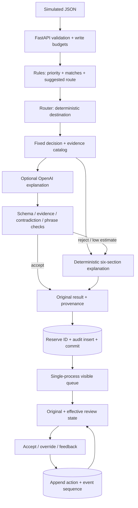

# Implemented architecture and API contract

[Repository](https://github.com/hsivasambu/clinical-alert-triage) · [Demo](https://clinical-alert-triage-t7t1.vercel.app) · [Blog](https://blog.harry-sivasambu.com/blog/clinical-alert-triage)

Current portfolio implementation, not proposed clinical architecture. [README](../README.md) covers setup, walkthrough and verification. [models.py](../backend/models.py) and running `/docs` are the complete schema reference.

## Authority and persistence flow



`decision_layer.apply` sets `final_priority = baseline_priority`; `router.resolve_route_with_reason` selects route. No model field can change either. Rules prefer highest priority, then route urgency on ties. Router precedence: Critical in ICU-keyword unit → ICU Team; other Critical → Rapid Response Team; High in ICU → ICU Team; otherwise infusion matching configured drug keywords → Pharmacy + Bedside Nurse; otherwise retain rule route. This is substring-based demo routing, not a hospital directory or clinical inference.

`_persist_alert` rejects existing/in-flight IDs before generation, commits SQLite, then publishes memory. Transactional `alert_registry` enforces durable uniqueness across callers/restarts; failed inserts roll back reservation and remain invisible. Storage failures return 503; duplicates 409. Append-only behavior is application policy, not tamper-proof storage against a database operator.

## Ingestion contract

`POST /alerts` returns 201 with `TriageResult`. Minimal complete synthetic example (a fixed historical timestamp):

```json
{
  "alert_id": "DOC-SPO2-001",
  "source_system": "Documentation-Simulator",
  "alert_type": "low_spo2",
  "patient_id": "SYNTHETIC-001",
  "unit": "ICU",
  "timestamp": "2026-10-05T12:00:00Z",
  "vital_signs": {"spo2": 85},
  "repeat_count": 0,
  "recent_context": {},
  "additional_context": {}
}
```

Use a fresh unique ID for a new submission. Fields are **`alert_type`**, **`vital_signs`**, not `type`/`vitals`. Required: nonblank `alert_id`, `source_system`, `patient_id`, `unit`, supported `alert_type`, timezone-aware ISO 8601 `timestamp`. Optional `room`, `bed`, `device_type`, `message_text` are strings. Vital/context objects default to empty structures; repeat count defaults to 0 but omission is flagged unavailable. Types: `tachycardia`, `low_spo2`, `infusion_pump`, `nurse_call`, `fall_risk`, `sepsis`.

| Validated input | Broad demo format/range bounds |
| --- | --- |
| Heart rate / SpO2 | Finite numbers 0–400 bpm / 0–100% |
| Systolic / diastolic pressure | 0–400 / 0–300 mmHg, separate numeric fields |
| Respiratory rate / temperature | 0–100 breaths/min / 0–60 °C |
| Repeat count / prior alerts | Strict integers 0–1,000,000 |
| Fall-risk score | Optional strict integer 0–125 |
| Pump `alarm_type` / `infusate` | Optional strings; wrong types reject before rules |

Numeric strings, booleans, nonfinite values and unknown top-level/vital/recent-context keys reject with 422. `additional_context` retains other finite JSON metadata; typed pump keys prevent string-operation crashes. These bounds validate formats, not plausibility or normality.

Missing/null measurements never satisfy thresholds; zero remains observed. `missing_fields` names relevant unavailable inputs, even alongside matched repeat/base rules. `evaluation_status` is `matched` or `no_rule_matched`. `NO_RULE_MATCHED` is a policy marker, not normality: existing default stays Low → Bedside Nurse. Some types have generic/base rules, so missing data need not mean no match. A higher missing-data floor would require a separate rule-policy change.

## Response shape and endpoints

```text
TriageResult:
  alert_id, alert (validated AlertIn)
  rule_output: baseline_priority, matched_rules, suggested_route,
               rule_confidence, missing_fields, evaluation_status
  explanation: summary, rationale, factors_considered, uncertainty_notes,
               recommended_checks, explanation_mode, rule_trace,
               rule_evidence, triggering_rule_ids, context_observations,
               referenced_context_ids, explanation_version, fallback_reason,
               llm_self_reported_confidence, llm_confidence_estimate,
               confidence_cap, confidence_cap_reason
  final_priority, final_route, processed_at
  provenance (nullable GenerationProvenance)
  review_state (nullable in legacy/raw records; populated by list/detail reads):
    effective_priority, effective_route, decision_version, review_status
```

`alert.timestamp` is alert time; `processed_at` is processing time. `explanation_mode` is inside `explanation`. There is no root `llm_output` or root `timestamp`. `rule_evidence` supplies ID/condition; observations supply evidence ID/label/value/unit/availability, separately from AI prose.

| Endpoint | Contract |
| --- | --- |
| `GET /alerts`, `GET /alerts/{id}` | Array / single result with current review state; unknown ID 404 |
| `POST /alerts/{id}/accept` | `{ "reviewer_id": "demo-reviewer", "decision_version": 0 }`; 201 snapshot; stale supplied version 409 |
| `POST /alerts/{id}/override` | `{ "reviewer_id": "demo-reviewer", "overridden_priority": "High", "overridden_route": "Charge Nurse", "reason": "Demo review of routing" }`; 201 override/current review state |
| `POST /alerts/{id}/feedback` | `{ "reviewer_id": "demo-reviewer", "rating": "not_helpful", "reason_category": "explanation_unclear", "comment": "Demo feedback" }`; 201 record |
| `GET /alerts/{id}/audit` | `triage_result`, `overrides`, `feedback`, `acceptances`, current `review_state` |
| `GET /audit` | Original-system summaries, counts/provenance; filters `alert_type`, `final_priority`, `explanation_mode`, `overridden_only`; `limit` 1–1000, default 100 |
| `GET /meta/feedback-categories` | Allowed category strings |
| `GET`/`HEAD /health` | 200 liveness, not storage/provider readiness |
| `GET /ready` | Initializing 202 / ready 200 / unavailable 503; alert count/seed failures |

Audit `final_priority` filters original decisions; queue priority filters effective values. Feedback categories: `explanation_unclear`, `incorrect_rule_cited`, `missing_clinical_context`, `routing_disagree`, `too_verbose`, `other`. `not_helpful` requires one; category names do not establish clinical validation. Feedback never retrains/modifies anything.

## Human versions

Original version is 0. Each override ID creates a new effective version; global IDs need not be consecutive per alert. Latest priority wins; omitted/empty route retains preceding effective route. Humans can lower Critical; route strings are not a controlled permission policy. Reviewer labels are unauthenticated.

Acceptance snapshots `decision_version`, `accepted_priority`, `accepted_route` at commit. A supplied stale version rejects atomically. Omitted version remains compatible with old clients and accepts whatever is current then. Only acceptance of current version/values yields `accepted`; a later override yields `overridden`. Repeated acceptances append; unknown legacy snapshots remain unknown.

The UI loads history on selection, isolates drafts by alert, and updates queue/detail from successful action responses. Failed subsequent history refresh does not prompt duplicate submission. Write timeout can have committed: read history before retrying.

## Explanation contract and fallback

Prompts include fixed priority/route/router rationale, triggering-rule evidence and contextual catalog. They forbid new decisions, diagnoses, causes and treatment. Default provider `gpt-4o-mini` is configurable via `LLM_MODEL`; `LLM_ENABLED=false`, absent key and startup seeding bypass provider. Timeout 15 seconds, retries zero.

Strict provider JSON fields: `summary`, `rationale`, `factors_considered`, `uncertainty_notes`, `recommended_checks`, `triggering_rule_ids`, `context_evidence_ids`, `confidence`. Text/items must be trimmed/nonempty; factor/check lists nonempty; confidence finite 0–1; extra fields reject. Trigger IDs must match supplied triggering evidence; context IDs must be supplied observations. Recognized numeric claims/units must match available cited measurements. Detected contradictions/prohibited phrases reject. Canonical factual values/trace render from input/rules.

Deterministic fallback fills summary, factors, routing rationale, uncertainty, rule trace and source/evidence verification guidance without inventing missing facts. New versions: `deterministic-v2`, `validated-llm-v2`.

| Reason | Meaning |
| --- | --- |
| `llm_disabled` | No provider call: disabled, absent key or offline seed |
| `provider_failure` / `provider_timeout` | Adapter/provider error / timeout |
| `malformed_output` | Empty/unparseable response |
| `schema_invalid` | Invalid schema, including blank items or authority fields |
| `low_confidence` | Validated/capped estimate below 0.5 |
| `content_rejected` | Provider refusal/filter or configured prohibited content |
| `evidence_mismatch` | Invalid IDs or recognized measurement claims |
| `contradiction` | Detected priority/routing contradiction |
| `not_supplied` | Local caller supplied no model outcome |

Legacy null reasons stay unrecorded, not guessed. Rejected raw provider text is not archived as narrative. Validation does **not** guarantee semantic safety: unsupported nonnumeric statements, paraphrases, negation and multilingual text can escape or produce false positives. Evaluation demonstrates an escape. No public fault-injection endpoint exists.

### Confidence

Raw `llm_self_reported_confidence` is an explanation estimate, not diagnostic certainty. Displayed estimate is `min(raw, cap)`; below 0.5 falls back. Caps count available measurements/context signals/noise markers without calibration:

| First matching condition | Cap |
| --- | --- |
| At most one measurement and one context signal | 0.72, or 0.68 with configured noise |
| At most two measurements | 0.78, or 0.74 with noise |
| At most three measurements, at most one context signal, or noise | 0.82 |
| Otherwise | 0.95 |

Signals count prior alerts, medications, fall score, admission reason and code status when present/nonempty; noise markers are exact configured values in additional metadata. Implementation: `_confidence_cap` in [llm_explainer.py](../backend/llm_explainer.py). `rule_confidence` averages manual matched-rule weights (0.5 for no match); not measured reliability or decision authority.

## Audit and reproducibility

Actual tables: `audit_log`, `alert_registry`, `overrides`, `acceptances`, `feedback`, `review_events`. Original audit stores input/rule/result JSON and summary columns. Reviews append separately; action and cross-type event sequence commit together. History shows reviewer/time, override reason, acceptance snapshot, feedback category/comment. Legacy events without sequence have stable display tie-breaking but unknown exact simultaneous cross-type order.

New provenance: `rules_version`, `prompt_version`, `prompt_hash`, `rendered_prompt_hash`, `configured_model`, `returned_model` when supplied, `validation_version`, `validation_outcome`, `validation_issues`, `fallback_reason`, `generation_duration_ms`, `request_correlation_id`. Hashes identify code/templates/messages, not identical stochastic outputs. Accepted text/evidence is preserved, not rejected raw payloads. Additive nullable fields preserve old records without regeneration. Valid incoming `X-Request-ID` is echoed; otherwise an ID is generated.

Startup reloads persisted originals, then seeds six offline fixtures only if empty/enabled. Wholly unreadable history/storage failures yield unavailable, not empty. Partial seeding/readiness counts remain visible. `/alerts` keeps array compatibility with `X-Demo-State`. Frontend polls at most six initializing reads every two seconds, or three failed reads with one/two-second retry delays; then manual Retry. Read/write abort after 10/25 seconds including body consumption. No automatic write retry.

## Operations and verified results

One worker is required: queue/rate state is not distributed. `DEMO_DB_PATH` replaces the old planned `DATABASE_URL`. Persistent SQLite mount retains server-restart history; ephemeral hosting may erase it. No TTL/public reset. Operator reset: stop writes, archive actual DB plus WAL/SHM if present, restart. Running backups use SQLite backup APIs. Browser refresh never resets storage.

POST guards: 16 KiB, ten-second receive deadline, 20 writes/client/minute, 120/process/minute, concurrency two; 1,000 alert IDs and 10,000 reviews. Overrides in [demo.env.example](../backend/demo.env.example). Configure trusted proxies, CORS, external billing/request limits, persistent disk, readiness/liveness. Limits do not authenticate or guarantee abuse prevention. [README](../README.md#persistence-startup-and-deployment) provides deployment steps.

At source `2a1b169`: 211 backend, 43 UI, 16 local browser/layout and two real API integration tests passed; type check/build passed. [Hosted CI](https://github.com/hsivasambu/clinical-alert-triage/actions/runs/37359198842) passed. [Evaluation](evaluation-report.md): 1,020 deterministic combinations with expected authority/schema agreement, 900 complete fallbacks; adversarial rejection 420/480 and 60 correlated unsupported-claim escapes. No human/clinical quality score. Reviewer permissions, distributed state, broader semantic/human assessment and clinical integration remain future work.
